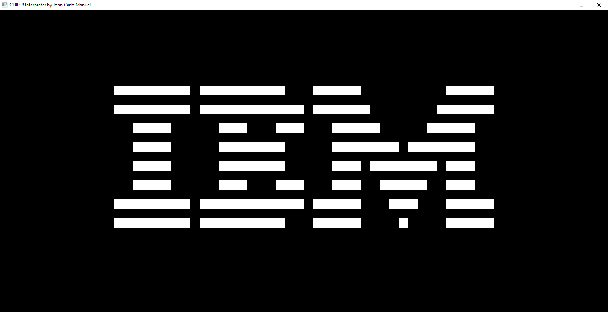

# CHIP-8 Interpreter

CHIP-8 Interpreter built in C++. This program essentially interprets the opcodes inside .ch8 files, emulating the state the files themselves, and ultimately stays true to the original specifications.

<!-- Some pics here -->


## ! Note !
It is **illegal** to distribute ROMs online. I cannot upload any ROMs to this repository!

## History
CHIP-8 is an interpreted programming language developed by Joseph Weisbecker, a microprocessor and microcomputer researcher. It was mainly employed in early computers such as the COSMAC VIP and the Telemac 1800 for programming video games. Read more about it [here](https://en.wikipedia.org/wiki/CHIP-8).

## How to Run
This assumes you have a ROM on disk.
1. Install a C++ compiler and the [SDL Development Library](https://www.libsdl.org/download-2.0.php) (I'll be using [GCC](https://gcc.gnu.org/) for this quick tutorial). Be sure to add them to PATH.
2. Download or clone this repository
3. Extract the SDL contents into the repository folder
   1. Feel free to install SDL somewhere else, but you will have to modify the path variables in Makefile. 
4. Run the following commands in the terminal:
   1.  ```mingw32-make```
   2.  ```CHIP-8```

## To-Do
- Add options and GUI features for better customization and user experience (**increase** and adjust resolution, turn on debugging mode, open files through a GUI instead of typing the filename)
- Improve interpreter's compatibility for other games (Pong, Space Invaders)
- Optimize emulator code (making use of STL arrays over C-style arrays for flexibility)
- Upgrade to SCHIP, because why not?